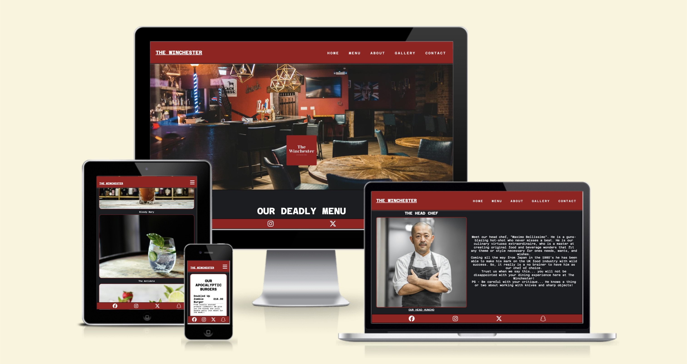
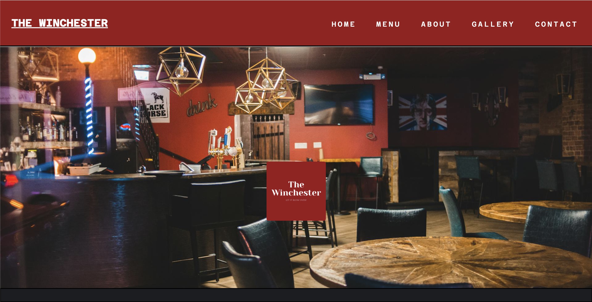
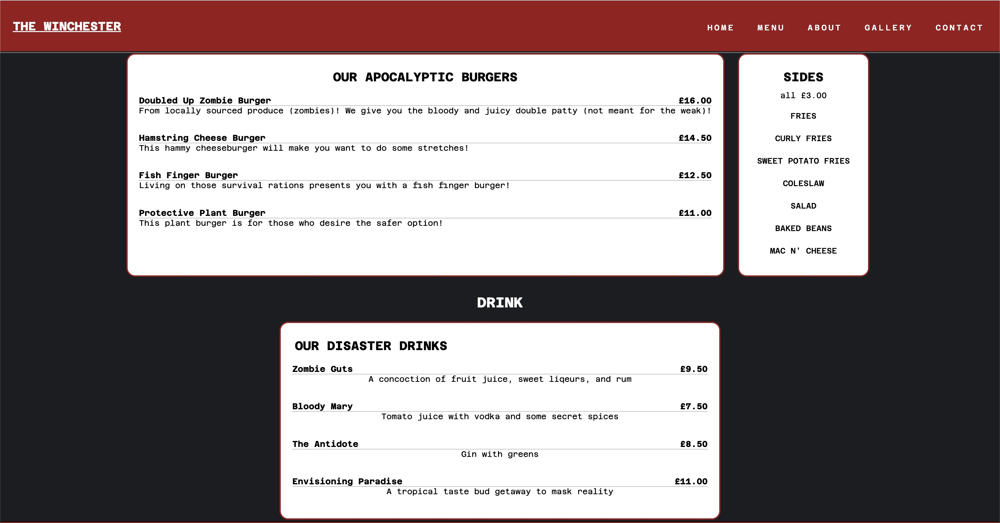
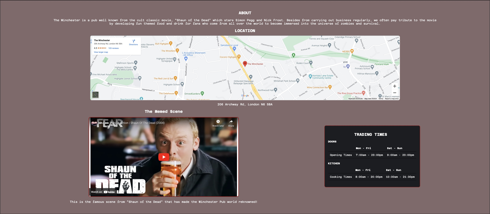
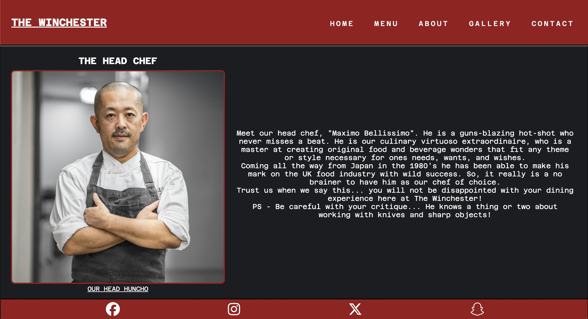
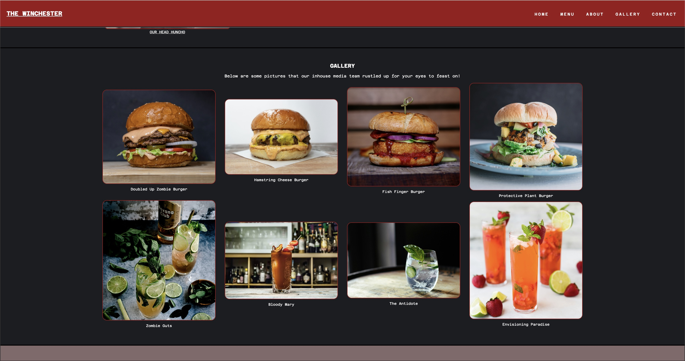
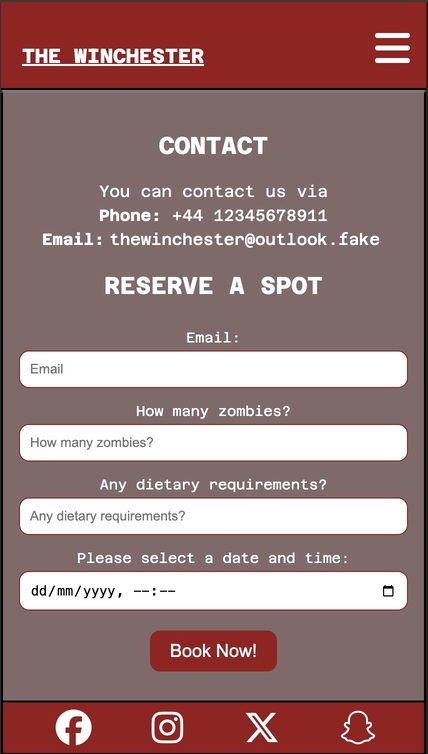
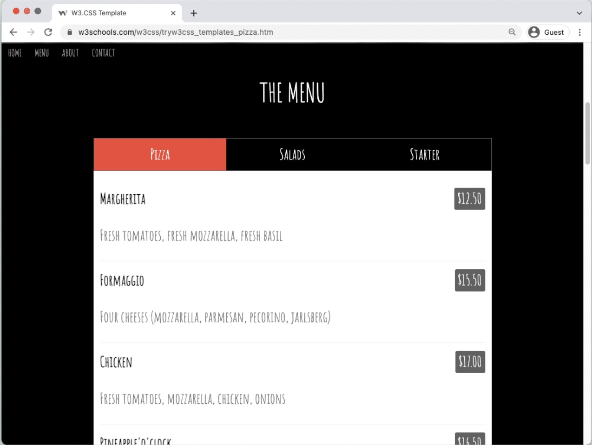

# THE WINCHESTER 

The Winchester is a website that brings together fans of the movie "Shaun of the Dead" who wish to embark on an immersive food and drink experience that is likened to the theme of the famously referenced pub "The Winchester Tavern"; which has even turned into a viral internet meme during the COVID-19 pandemic, with the famous line "Then pop to the Winchester and wait for all this to blow over". This is simply to be applied to any other catastrophe and in the context of "Shaun of the Dead" this happened to be a zombie apocolyspe. This website is the gateway to a fun filled "Shaun of the Dead" pub style immersive experience but that also maintains the setting of your typical British Pub. 

## SCREENSHOTS 

## USER EXPERIENCE | UX 

### USER STORIES 

#### TARGET AUDIENCE:

- Fans of "Shaun of the Dead" movie who want a fun food and drink experience that immerses them into the world of Shaun of the Dead.
- Frequent pub goers who want to experience something that delivers another facet of entertainment through a zombie themed spectacle.

#### GOALS FOR USER:

- See an image of the pub be it interior or exterior. 
- Check out an original fun themed food and drink menu - zombie style.
- See some further context via an about page.
- Know where the location is.
- Be able to contact and make a booking.
- Showcase standout food and drink photos.
- Links to social media accounts to allow for further exploration of content. 

#### First Time Users: 

- As a first time user, I would expect to be able to navigate through the website with ease.
- As a first time user, I would want to see integrity via reviews. 
- As a first time user, I would want to see strong references to Shaun of the Dead. 
- As a first time user, I would expect an obvious presentation of what food and drink is on offer.
- As a first time user, I would like to see positive back-ground info on the headchef. 

#### Returning Visitor Goals:

- As a returning visitor, I would like to see any updates on food and drink.
- As a returning visitor, I would expect the same website structure and layout.
- As a returning visitor, I would be intrigued to see recent customer reviews. 

#### Frequent User Goals:  

- As a frequent user, I would be interested in some form of payback for regular customer behaviour.
- As a frequent user, I would be again would be interested to see developments with food and drink.
- As a frequent user, I would like to see blog posts, newsletters, or ways I can be frequently informed about the pub. 

#### The Winchester stands to fulfill these goals by:

- The website has a punchy and contrasting colour scheme that matches the shaun of the dead movie poster.
- The website has a simple and well-structured page layout that is easy to navigate.
- Presents an obvious food and drink menu.
- Presents a gallery for the food and drink menu.
- Has an about section that provides more context with prominent references to shaun of the dead. 
- Has a whole section dedicated to contact, bookings, times, and location.
- Offers a link to social media accounts and tripadvisor. 

## FEATURES 

Below are the key features of the website: 

### HERO

This achieved the key project goals for the intended target audience because:

### MENU 

This achieved the key project goals for the intended target audience because:

### ABOUT 

This achieved the key project goals for the intended target audience because:

This achieved the key project goals for the intended target audience because:

### GALLERY 

This achieved the key project goals for the intended target audience because:

### CONTACT 

This achieved the key project goals for the intended target audience because:

## TESTING 

### VALIDATING 

The websites to validate the code were W3C Markup and W3C CSS:

1) W3C Markup - 100% validated other than a slight discrepancy with "trailing slash" on around 30+ lines of code. However, the cause of this was directly linked to the extension "prettier" that was utilised to tidy up the code. 

2) W3C CSS - 100% validated with no issues. 

### FUNCTIONALITY

| FUNCTION | ITEM | RESULT | 
| ----------- | ----------- | ------ 
| ADJUST WITH SCREEN SIZE |  HEADER | PASS |
| ADJUST WITH SCREEN SIZE |  NAVBAR | PASS |
| ADJUST WITH SCREEN SIZE |  MENU | PASS |
| ADJUST WITH SCREEN SIZE |  ABOUT | PASS |
| ADJUST WITH SCREEN SIZE |  HEAD CHEF | PASS |
| ADJUST WITH SCREEN SIZE |  GALLERY | PASS |
| ADJUST WITH SCREEN SIZE |  CONTACT | PASS |
| ADJUST WITH SCREEN SIZE |  FOOTER | PASS |
| OPENING LINKS | FACEBOOK | PASS |
| OPENING LINKS | INSTAGRAM | PASS |
| OPENING LINKS | TWITTER/X | PASS |
| OPENING LINKS | SNAPCHAT | PASS |
| OPENING LINKS | TRIPADVISOR | PASS |

## BUGS 

1) On the initial deployment the custom logo did not load in but this was quickly realised due to the incorrect file pathway of "..assets/" rather than "assets/". 

2) The navbar was overflowing and failed to block display the navtoggle when attempting to make it responsive at 768px. The temporary fix here was to simply extend the media query to 777px rather than the original tablet size of 768px. This is something that would need to be looked at again to ensure it doesn't overflow at 768px. 

3) Another issue that was highlighted by **Wave** was an empty label tag in the navtoggle causing a screen reader error, even though it had a font awesome icon contained inside. This was resolved by inserting a b tag with a class styled to display none. 

## ACCESSIBILITY

The extension "wave" was put to use and 

## DEPLOYMENT 

The website was deployed on github and can be accessed here: https://ojay97-hub.github.io/The-Winchester/ 
## FUTURE 

To improve upon this website further discussion will cover the key factors of style and coding:

### STYLE

#### MENU 
The menu is quite simple only showing a few divs. The menu style I was aiming for was one that was demonstrated by W3Schools:

### CODING

## CREDIT 