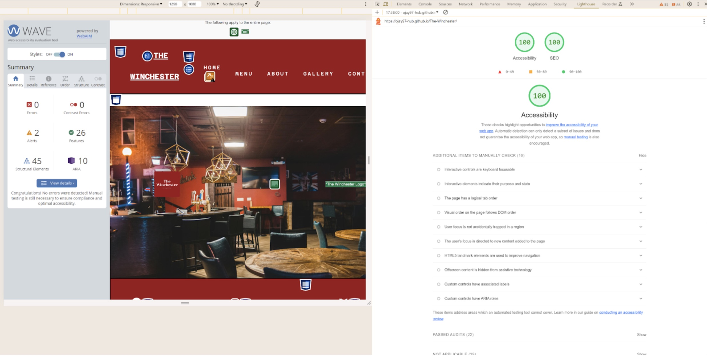

# THE WINCHESTER 

The Winchester is a website that brings together fans of the movie "Shaun of the Dead" who wish to embark on an immersive food and drink experience that is likened to the theme of the famously referenced pub "The Winchester Tavern"; which has even turned into a viral internet meme during the COVID-19 pandemic, with the famous line "Then pop to the Winchester and wait for all this to blow over". This is simply to be applied to any other catastrophe and in the context of "Shaun of the Dead" this happened to be a zombie apocolyspe. This website is the gateway to a fun filled "Shaun of the Dead" pub style immersive experience but that also maintains the setting of your typical British Pub. 

## SCREENSHOTS 

## USER EXPERIENCE | UX 

### USER STORIES 

#### TARGET AUDIENCE:

- Fans of "Shaun of the Dead" movie who want a fun food and drink experience that immerses them into the world of Shaun of the Dead.
- Frequent pub goers who want to experience something that delivers another facet of entertainment through a zombie themed spectacle.

#### GOALS FOR USER:

- See an image of the pub be it interior or exterior. 
- Check out an original fun themed food and drink menu - zombie style.
- See some further context via an about page.
- Know where the location is.
- Be able to contact and make a booking.
- Showcase standout food and drink photos.
- Links to social media accounts to allow for further exploration of content. 

#### First Time Users: 

- As a first time user, I would expect to be able to navigate through the website with ease.
- As a first time user, I would want to see integrity via reviews. 
- As a first time user, I would want to see strong references to Shaun of the Dead. 
- As a first time user, I would expect an obvious presentation of what food and drink is on offer.
- As a first time user, I would like to see positive back-ground info on the headchef. 

#### Returning Visitor Goals:

- As a returning visitor, I would like to see any updates on food and drink.
- As a returning visitor, I would expect the same website structure and layout.
- As a returning visitor, I would be intrigued to see recent customer reviews. 

#### Frequent User Goals:  

- As a frequent user, I would be interested in some form of payback for regular customer behaviour.
- As a frequent user, I would be interested to see developments with food and drink.
- As a frequent user, I would like to see blog posts, newsletters, or ways I can be frequently informed about the pub. 

#### The Winchester stands to fulfill these goals by:

- The website has a punchy and contrasting colour scheme that matches the shaun of the dead movie poster.
- The website has a simple and well-structured page layout that is easy to navigate.
- Presents an obvious food and drink menu.
- Presents a gallery for the food and drink menu.
- Has an about section that provides more context with prominent references to shaun of the dead. 
- Has a whole section dedicated to contact, bookings, times, and location.
- Offers a link to social media accounts and tripadvisor. 

## FEATURES 

Below are the key features of the website: 

### HERO

- The hero image acts as a window to the interior of the pub. 
- It allows users to see the layout and style of the pub which to some can be very appealing and enticing and to others may be the deciding factor whether they would like to come or not. 
- This also helps by reassuring the user that the pub does in fact exist and provides integrity. 

### MENU 

- The menu page is simple but is extremely readable and easy to follow. Sort of does what it says on the tin. 

- The contrasting and punchy styling resembles one that is contemporary and modern, and is something you could find in a trendy food market that happens to sells craft beer. 

- The food and drink was thematically suited to zombies and shaun of the dead. This would come as expected, given it is advertised as a Shaun of the dead themed pub experience. The names are original and quirky. 

### ABOUT 

- The about page has your basic info required to allow the users to 1. Know the location 2. know the trading times 3. Have some background context regarding its purpose 4. See a video giving even more context of what the pub is based on for users who may not be well accustomed to the movie. 

- The head chef section really gives the user an insight as to who is behind all of the thematic food and drink. The lighthearted and humourous description really sells positivity to the user, which would add further appeal and desire for them to be patrons. But also for them to hopefully find using the website enjoyable. 

- The image used is eye-catching and clearly stands out. The clarity of it may help users feel like there is transparency and therefore they may build trust with the website. 

### GALLERY 

- The gallery contains 8 images all based off the thematic food and drink items in the menu section. Unsplash really had some great quality photos to use. They were eventually resized so that they look more identical, rather than having a few images that looked more potrait rather than landscape; which resulted in a better flowing gallery and in turn is beneficial for the user.   

### CONTACT 

- The contact page has all that one need for to get in contact 1. phone number 2. email. 
- The contact presents the user with a form to fill that is super quick and easy to complete for them to make a reservation. 
- A 5 star trip advisor image is displayed below the form as a way to say to the user - we are legit and people have been here before and thoroughly enjoyed their experience. This provides comfort to the user which may persuade them to make a reservation. 
- The footer which contains social media links, acts as an extension to the contacting category of elements. Having these displayed as fun clickable icons allows the user to investigate the pub further where they are exposed to more content that could sway them into making a reservation. 

### ERROR 

- Added in an error page which shows a glimpse of whats to come in the working website. Keeping that tongue and cheek language style which should be inviting for the potential users.         

## TESTING 

### VALIDATING 

The websites to validate the code were W3C Markup and W3C CSS:

1) W3C Markup - 100% validated other than a slight discrepancy with "trailing slash" on around 30+ lines of code. However, the cause of this was directly linked to the extension "prettier" that was utilised to tidy up the code. 

2) W3C CSS - 100% validated with no issues. 

### FUNCTIONALITY

Below are the predominant website functions I would expect to work. I carried out testing and results are as follows:     

| FUNCTION | ITEM | RESULT | 
| ----------- | ----------- | ------ 
| ADJUST WITH SCREEN SIZE |  HEADER | PASS |
| ADJUST WITH SCREEN SIZE |  NAVBAR | PASS |
| ADJUST WITH SCREEN SIZE |  MENU | PASS |
| ADJUST WITH SCREEN SIZE |  ABOUT | PASS |
| ADJUST WITH SCREEN SIZE |  HEAD CHEF | PASS |
| ADJUST WITH SCREEN SIZE |  GALLERY | PASS |
| ADJUST WITH SCREEN SIZE |  CONTACT | PASS |
| ADJUST WITH SCREEN SIZE |  FOOTER | PASS |
| OPENING LINKS IN NEW TAB| FACEBOOK | PASS |
| OPENING LINKS IN NEW TAB| INSTAGRAM | PASS |
| OPENING LINKS IN NEW TAB| TWITTER/X | PASS |
| OPENING LINKS IN NEW TAB| SNAPCHAT | PASS |
| OPENING LINKS IN NEW TAB| TRIPADVISOR | PASS |
| HOVER CHANGES COLOUR | NAV LINKS | PASS |
| HOVER CHANGES COLOUR | BOOK BUTTON | PASS |
| CONFIRMATION PAGE | FORM | PASS |
| VIDEO USER PLAY | YOUTUBE VIDEO | PASS |
| CLICK ON LOGO REVERTS TO HOME PAGE | HEADER LOGO | PASS | 
| CUSTOM ERROR PAGE OPENS | 404.html | PASS | 
| FORM REQUIRED LABELS | FORM INPUTS | PASS | 
| CLICK ON: EMAIL POP UP FOR RESERVATION | EMAIL | PASS |

## BUGS 

1) On the initial deployment the custom logo did not load in but this was quickly realised due to the incorrect file pathway of "..assets/" rather than "assets/". 

2) The navbar was overflowing and failed to block display the navtoggle when attempting to make it responsive at 768px. The temporary fix here was to simply extend the media query to 777px rather than the original tablet size of 768px. This is something that would need to be looked at again to ensure it doesn't overflow at 768px. 

3) Another issue that was highlighted by **Wave** was an empty label tag in the navtoggle causing a screen reader error, even though it had a font awesome icon contained inside. This was resolved by inserting a b tag with a class styled to display none. 

4) Putting the tripadvisor image inside the footer created a problem where the footer was too large and covering contact content - I tried putting margin-bottom on the contact section but this was to no avail. Instead, I put the image underneath the form and this actually looked better stylistically.  

## ACCESSIBILITY

The extension "wave" and lighthouse was put to use to assess the accessibility of the website to ensure it is screenreader standard. The accessibility results were 100% with no errors. 

Wave was good at indicating errors and suggesting fixes. For example, the table had empty headers and suggested that they should be replaced with td tags; which makes sense because you cannot have an empty header. 

## DEPLOYMENT 

The site was deployed onto github pages:

1) On the repository click settings. 
2) On the source click main branch.  
3) Click save. 
4) Page will refresh.  
5) Retrieve the page link under github pages header. 
6) Back on the repo page you can head to deployments.
7) The link should display under github-pages deployments.  

The website was deployed on github and can be accessed here: 

## FUTURE 

To improve upon this website further discussion will cover the key factors of content, style and coding:

### CONTENT

There could be many more sections to be added given the nature of a themed pub experience: 

1) An event page.
2) An email newsletter sign-up. 
3) A blog page where there could be article content regarding scifi movies etc. 
4) A room hire page.
5) Possibly, a local food delivery service for online food orders. 

### STYLE

#### MENU 
The menu is quite simple only showing a few divs. The menu style I was aiming for was one that was demonstrated by W3Schools:

### Wireframes 
For future projects, I intend to make use of balsamiq and design wireframes beforehand. I didn't do so for this project as I didn't want to design something that could have been too ambitious where I would then struggle. The styles made for this project were done through some inspo material from other pubs that I liked the look of for instance; The Duke Williams:

### CODING
#### COMMITS 
I am aware that early commits have, at times, been too large with the message not really conveying all that was changed i.e., features/fixes. However, the commits did improve after the middle mentor session. Going into subsequent projects, commits will be made a far better standard, now that source control was pointed out to me in the final mentor session. 

#### CODE
Going forward I will try to ensure that there are fewer lines of code i.e., make the code clean, and avoid any redunancies where possible. 

## CREDIT 
- Initially followed the Love Running walkthrough with the header, navbar/toggle, and hero. 
- Unsplash 
- Favicon.io 
- Fontawesome 
- Wix logo maker
- Google fonts 

- colour scheme was taken from the Shaun of the Dead movie poster. 
